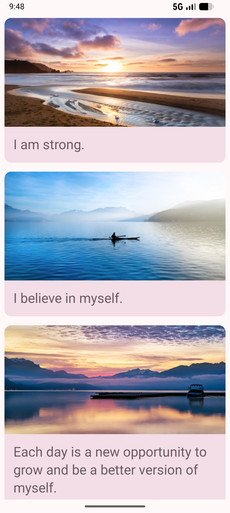
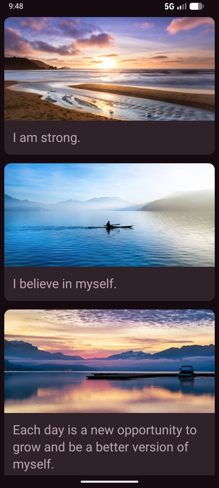

<div align="center">


# Affirmations App


</div>

## About the Project

**Affirmations** is a simple Android application that displays a scrollable list of inspiring affirmations combined with beautiful imagery. This project serves as a practical implementation of modern Android development concepts, specifically focusing on **Jetpack Compose** and **Material Design 3**.

The application demonstrates how to handle data lists efficiently and display them using a clean, modern interface.

## Key Features

- **Material 3 Design**: Implemented using Material 3 components, including Cards and standardized typography.
- **Lazy Layouts**: Uses Jetpack Compose LazyColumn for efficient rendering of long lists.

## Screenshots

<table align="center">
  <tr>
    <th align="center">Light Mode</th>
    <th align="center">Dark Mode</th>
  </tr>
  <tr>
    <td align="center"></td>
    <td align="center"></td>
  </tr>
</table>

## Tech Stack

- **Language**: [Kotlin](https://kotlinlang.org/)
- **UI Framework**: [Jetpack Compose](https://developer.android.com/jetpack/compose)
- **Design System**: [Material Design 3](https://m3.material.io/)
- **Target SDK**: 37
- **Min SDK**: 24

## Project Structure

```text
app/src/main/java/com/example/affirmations/
├── data/           # Data source and repositories
├── model/          # Data classes and models
├── ui/theme/       # Material 3 Theme configuration (Color, Type, Shape)
└── MainActivity.kt
```

## License

This project is licensed under the MIT License - see the [LICENSE](LICENSE) file for details.

## Acknowledgments

This project is a modified/copy version of the [Google Developer Training: Affirmations App](https://github.com/google-developer-training/basic-android-kotlin-compose-training-affirmations).
