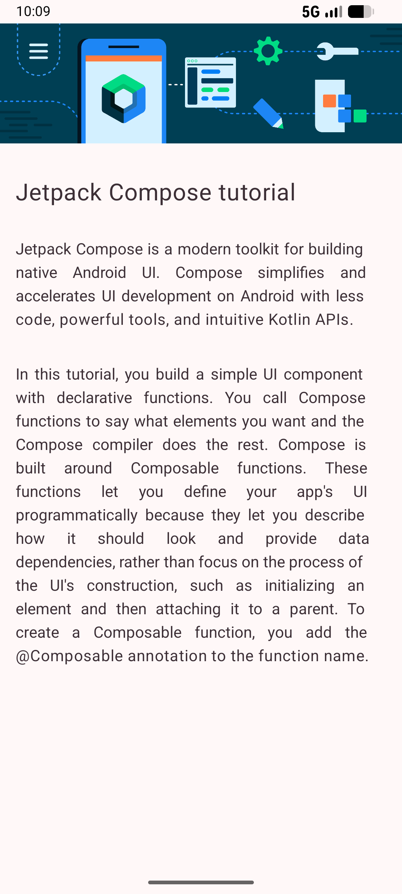
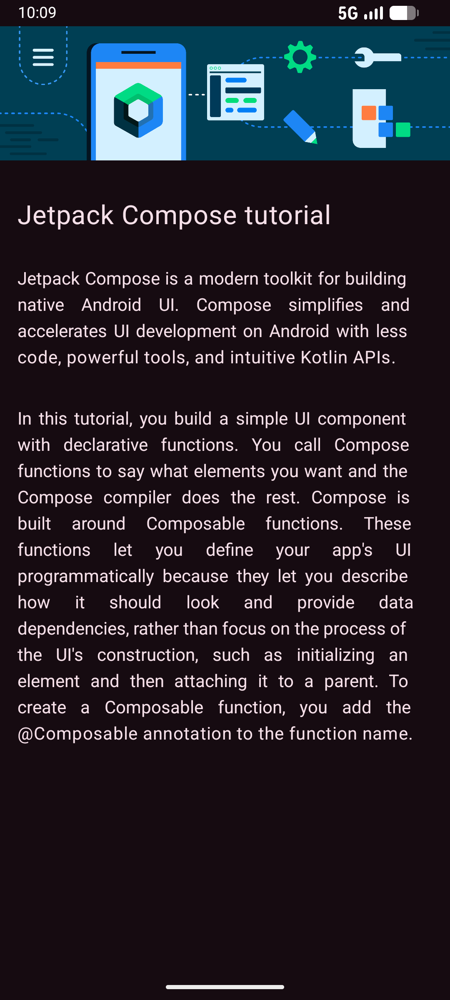

# Article App

Article is a simple Android application built with Jetpack Compose and Material Design 3. It demonstrates how to implement a background image and follows modern Android development practices.


## About the Project

This project serves as a practical implementation of Jetpack Compose and Material Design 3. It focuses on clean UI implementation and efficient resource handling.

## Key Features

- Material 3 Design: Implemented using Material 3 components and standardized typography.
- Jetpack Compose: Built entirely with declarative UI for a modern development experience.

## Screenshots

<table align="center">
  <tr>
    <th align="center">Light Mode</th>
    <th align="center">Dark Mode</th>
  </tr>
  <tr>
    <td align="center"></td>
    <td align="center"></td>
  </tr>
</table>

## Tech Stack

- Language: Kotlin
- UI Framework: Jetpack Compose
- Design System: Material Design 3
- Target SDK: 37
- Min SDK: 27

## Project Structure

```text
app/src/main/java/com/example/article/
├── ui/theme/       # Material 3 Theme configuration (Color, Type, Shape)
└── MainActivity.kt 
```

## License

This project is licensed under the MIT License - see the [LICENSE](LICENSE) file for details.