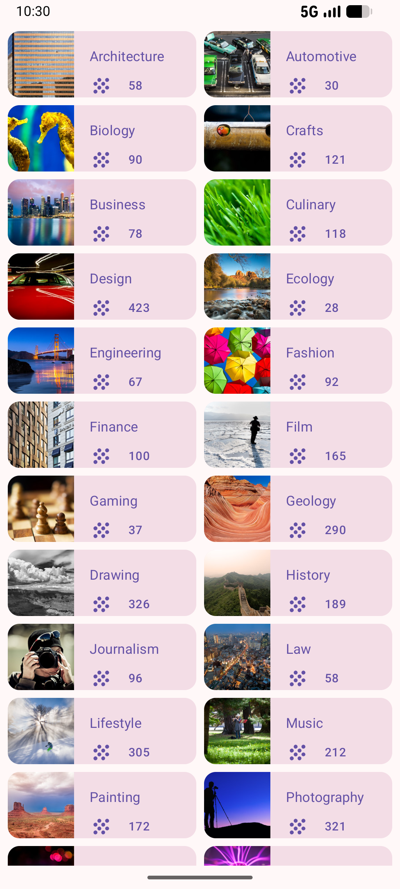
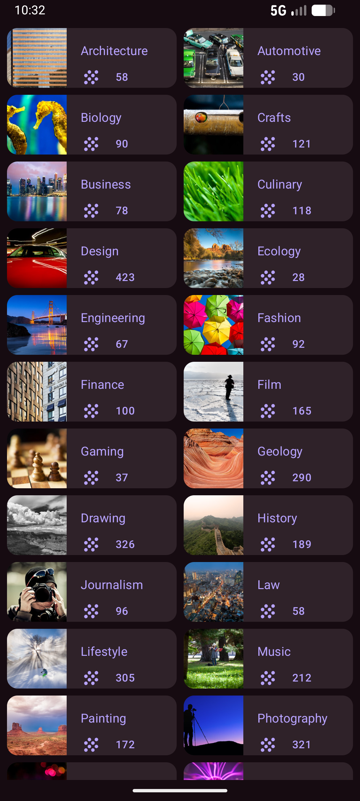

# Courses App

Courses App is a simple Android application built with Jetpack Compose and Material Design 3. It demonstrates how to implement a grid-based UI for displaying various topics or courses, following modern Android development practices.


## About the Project

This project serves as a practical implementation of Jetpack Compose `LazyVerticalGrid` and Material Design 3 `Card` components. It displays a list of topics with associated images and counts in a responsive grid layout.

## Key Features

- **Responsive Grid**: Uses `LazyVerticalGrid` to display items in a 2-column layout.
- **Material 3 UI**: Implemented using M3 `Scaffold`, `Card`, and `Text` with standardized typography and colors.

## Screenshots

<table align="center">
  <tr>
    <th align="center">Light Mode</th>
    <th align="center">Dark Mode</th>
  </tr>
  <tr>
    <td align="center"></td>
    <td align="center"></td>
  </tr>
</table>

## Tech Stack

- **Language**: Kotlin
- **UI Framework**: Jetpack Compose
- **Design System**: Material Design 3
- **Target SDK**: 37
- **Min SDK**: 26

## Project Structure

```text
app/src/main/java/com/example/coursesapp/
├── data/           # Data provider (DataSource.kt)
├── model/          # Data models (Topic.kt)
├── ui/theme/       # Material 3 Theme configuration
└── MainActivity.kt 
```

## License

This project is licensed under the MIT License - see the [LICENSE](LICENSE) file for details.