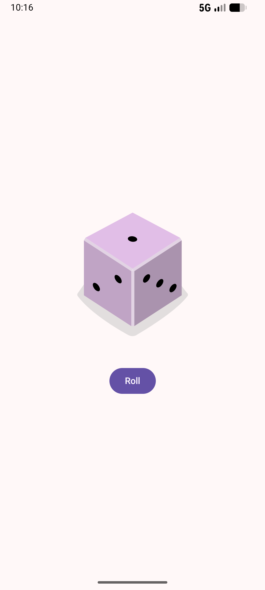

# Dice Roller

Dice Roller is a simple Android application built with Jetpack Compose and Material Design 3. It allows users to roll a virtual dice and see the result displayed as an image, demonstrating basic interactivity and state management in Compose.


## About the Project

This project is a beginner-friendly implementation of a dice rolling app. It showcases how to use `remember` and `mutableStateOf` to handle UI state, how to respond to button clicks, and how to conditionally display resources based on state.

## Key Features

- **Interactive Rolling**: Click the "Roll" button to generate a random number between 1 and 6.
- **Dynamic UI**: The dice image updates instantly to reflect the rolled value.
- **Material 3 UI**: Built using modern M3 components for a clean and responsive look.

## Screenshots

<p align="center">
  
</p>

## Tech Stack

- **Language**: Kotlin
- **UI Framework**: Jetpack Compose
- **Design System**: Material Design 3
- **Target SDK**: 36
- **Min SDK**: 27

## Project Structure

```text
app/src/main/java/com/example/diceroller/
├── ui/theme/       # Material 3 Theme configuration
└── MainActivity.kt # Core logic and UI components
```

## License

This project is licensed under the Apache License 2.0 - see the [LICENSE](LICENSE) file for details.