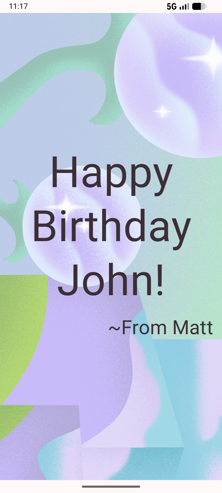

# Greeting Card App

Greeting Card App is a simple Android application built with Jetpack Compose and Material Design 3. It demonstrates how to create a visually appealing greeting card using images and text.


## About the Project

This project serves as a practical implementation of Jetpack Compose `Box`, `Image`, and `Text` components. It displays a birthday message with a background image, showcasing how to layer UI elements and use resources in Compose.

## Key Features

- **Layered UI**: Uses `Box` to overlay text on top of a background image.
- **Resource Management**: Demonstrates using string and drawable resources in a Compose-based project.
- **Material 3 UI**: Implemented using M3 `Scaffold` and standardized typography and colors.

## Screenshots

<td align="center"></td>

## Tech Stack

- **Language**: Kotlin
- **UI Framework**: Jetpack Compose
- **Design System**: Material Design 3
- **Target SDK**: 37
- **Min SDK**: 27

## Project Structure

```text
app/src/main/java/com/example/greetingcard/
├── ui/theme/       # Material 3 Theme configuration
└── MyActivity.kt
```

## License

This project is licensed under the MIT License - see the [LICENSE](LICENSE) file for details.
