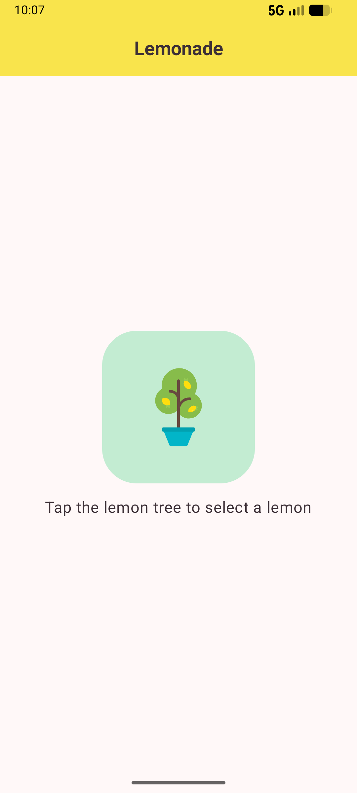
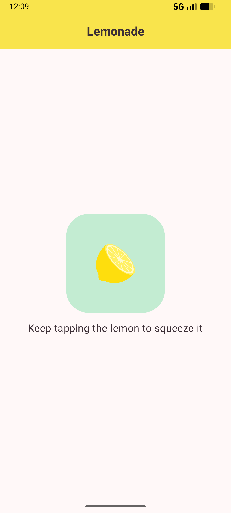
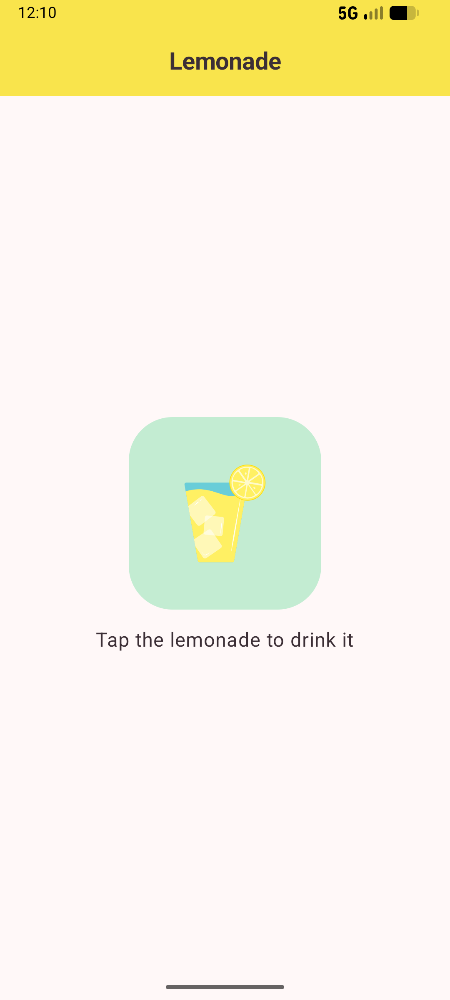
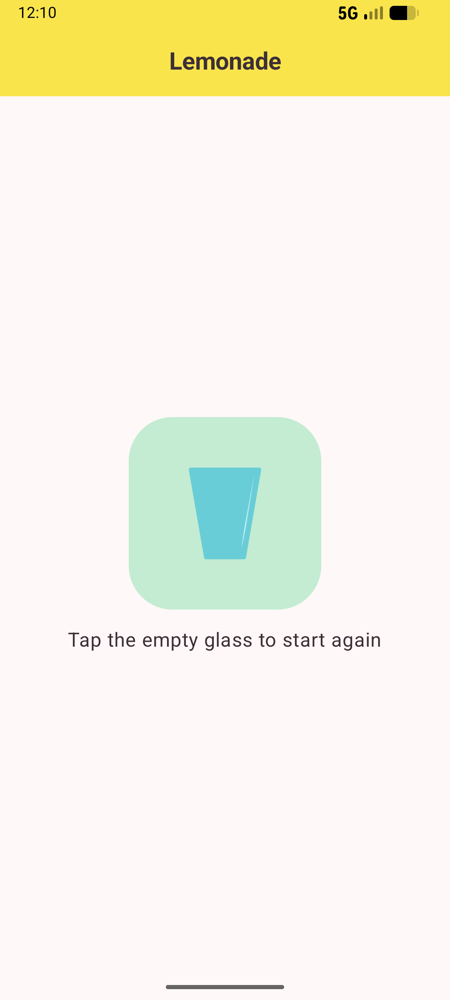

<div align="center">

# Lemonade App


</div>

## About the Project

Lemonade App is a fun, interactive Android application built with Jetpack Compose and Material Design 3. It guides users through the simple process of making lemonade: picking a lemon, squeezing it multiple times, drinking the lemonade, and restarting.

## Key Features

- **Interactive Flow**: A 4-step process (Pick, Squeeze, Drink, Restart) with randomized squeeze requirements.
- **State Management**: Uses Compose state to track progress and update UI dynamically.
- **Material 3 UI**: Features M3 components like `Scaffold`, `CenterAlignedTopAppBar`, `Button`, and custom theming for colors and shapes.

## Screenshots

<p align="center">

  
  
  
  

</p>

## Tech Stack

- **Language**: Kotlin
- **UI Framework**: Jetpack Compose
- **Design System**: Material Design 3
- **Target SDK**: 36
- **Min SDK**: 27

## Project Structure

```text
app/src/main/java/com/example/lemonade/
├── ui/theme/       # Material 3 Theme (Color, Theme, Type)
└── MainActivity.kt
```

## License

This project is licensed under the MIT License - see the [LICENSE](LICENSE) file for details.
