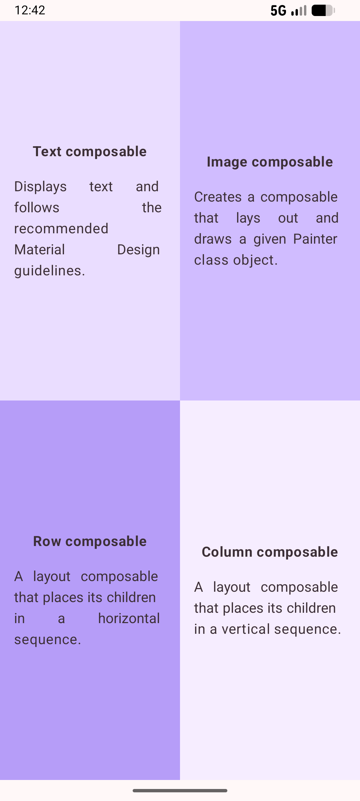

<div align="center">

# Quadrant App


</div>

## About the Project

This is a practice project from the Google Android Basics with Compose course. The app displays a 2x2 grid (quadrants) that explains four fundamental Jetpack Compose concepts: Text, Image, Row, and Column. Each quadrant has a unique background color and padding to follow Material Design guidelines.

## Key Features

- **2x2 Grid Layout**: Demonstrates the use of `Row` and `Column` with weights to create an equal distribution of space.
- **Material 3 Components**: Uses Material 3 theming for colors and typography.
- **Responsive Design**: Adapts to different screen orientations and sizes.
- **Informative Content**: Briefly describes core Compose building blocks within the UI.

## Screenshot

<div align="center">
  
</div>

## Tech Stack

- **Language**: [Kotlin](https://kotlinlang.org/)
- **UI Framework**: [Jetpack Compose](https://developer.android.com/jetpack/compose)
- **Design System**: [Material Design 3](https://m3.material.io/)
- **Target SDK**: 36
- **Min SDK**: 27

## Project Structure

```text
app/src/main/java/com/example/quadrant/
├── ui/theme/       # Material 3 Theme configuration (Color, Type, Shape)
└── MainActivity.kt
```

## License

This project is licensed under the MIT License - see the [LICENSE](LICENSE) file for details.

## Note

This project is a practice exercise from the [Google Android Basics with Compose training](https://github.com/google-developer-training/basic-android-kotlin-compose-training-practice-problems) and has been implemented by me for skill development.
