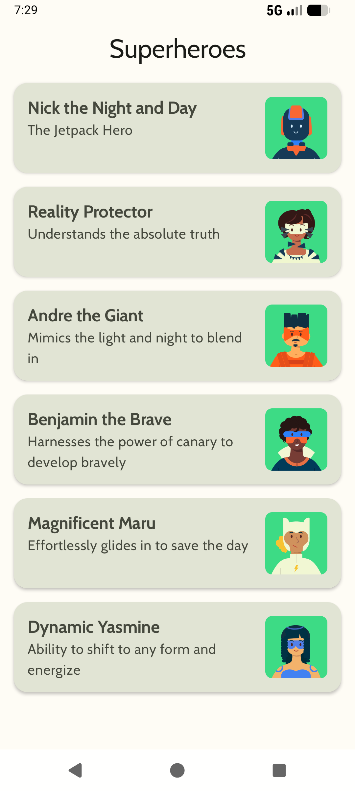
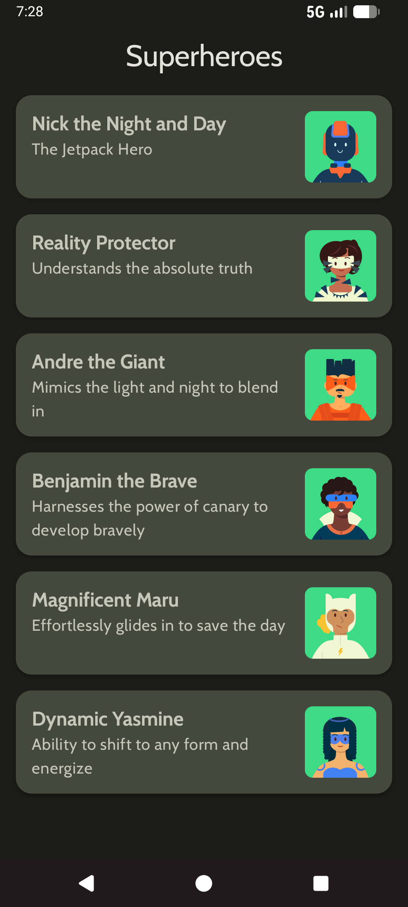

<div align="center">


# Superheroes App


</div>

## About the Project

This is a simple **superheroes** app which display's random superheroes in this list. Material theming is used to applied to the list. The app also uses basic spring animation when app launches at the first time.

## Key Features

- **Material 3 Design**: Fully implemented using Material 3 components and theming for a modern look and feel.
- **Responsive Layout**: Designed to look great on various screen sizes and orientations.
- **Dark Mode Support**: Beautifully crafted themes for both Light and Dark modes.

## Screenshots

<table align="center">
<tr>
    <th>Light Mode</th>
    <th>Dark Mode</th>
</tr>
<tr>
	<td>
		
	</td>
	<td>
		
	</td>
</tr>
</table>

## Tech Stack

- **Language**: [Kotlin](https://kotlinlang.org/)
- **UI Framework**: [Jetpack Compose](https://developer.android.com/jetpack/compose)
- **Design System**: [Material Design 3](https://m3.material.io/)
- **Build System**: Kotlin DSL Gradle
- **Target SDK**: 37
- **Min SDK**: 24

## Project Structure

```text
app/src/main/java/com/example/superheroes/
├── model/          # Data models and Repository
├── ui/theme/       # Material 3 Theme configuration (Color, Type, Shape)
└── MainActivity.kt # Main entry point and UI Composables
```

## License

This project is licensed under the MIT License - see the [LICENSE](LICENSE) file for details.

## Note

This subproject is clone of the [Google training repo](https://github.com/google-developer-training/basic-android-kotlin-compose-training-superheroes?tab=contributing-ov-file) and is modified by me. To improve my skills.