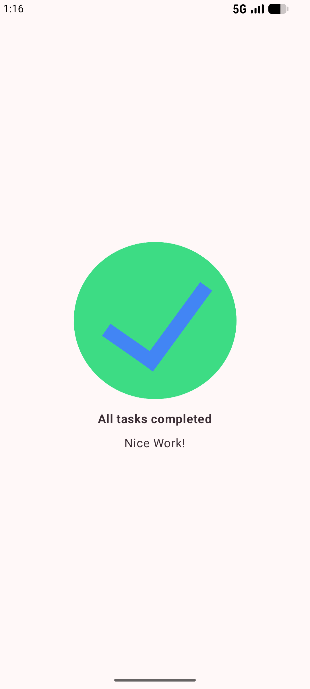

<div align="center">

# Task Manager App


</div>

## About the Project

This is a simple **Task Manager** completion screen app that displays a "Task Completed" message with a checkmark icon. It demonstrates basic Jetpack Compose layout principles like `Column`, `Arrangement`, and `Alignment`.

## Key Features

- **Material 3 Design**: Fully implemented using Material 3 components and theming.
- **Responsive Layout**: Centered content that adapts to screen sizes.
- **Jetpack Compose**: Built entirely with declarative UI.

## Screenshots

<p align="center">
  
</p>

## Tech Stack

- **Language**: [Kotlin](https://kotlinlang.org/)
- **UI Framework**: [Jetpack Compose](https://developer.android.com/jetpack/compose)
- **Design System**: [Material Design 3](https://m3.material.io/)
- **Target SDK**: 36
- **Min SDK**: 27

## Project Structure

```text
app/src/main/java/com/example/taskmanager/
├── ui/theme/       # Material 3 Theme configuration (Color, Type, Shape)
└── MainActivity.kt
```

## License

This project is licensed under the MIT License - see the [LICENSE](LICENSE) file for details.

## Note

This project is an exercise from the [Android Basics with Compose](https://developer.android.com/courses/android-basics-compose/course) course by Google.
