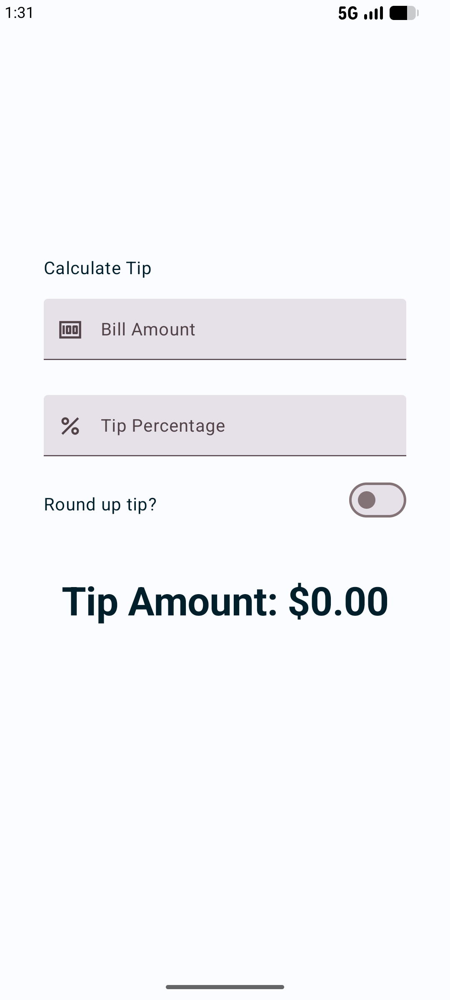

<div align="center">

# Tip Calculator App


</div>

## About the Project

This is a simple **Tip Calculator** app that calculates the tip amount based on the bill total and a custom tip percentage. It also includes an option to round up the tip. This project was built to practice building interactive UIs with Jetpack Compose.

## Key Features

- **Dynamic Calculation**: Real-time tip calculation as you type the bill amount or tip percentage.
- **Rounding Option**: Easily round up the tip to the nearest whole number using a toggle switch.
- **Custom Tip Percentage**: Input any tip percentage you desire.
- **Material 3 Design**: Fully implemented using Material 3 components for a modern look and feel.
- **Keyboard Optimization**: Specifically configured keyboard options for numerical input and focus transitions.

## Screenshots

<p align="center">
  
</p>

## Tech Stack

- **Language**: [Kotlin](https://kotlinlang.org/)
- **UI Framework**: [Jetpack Compose](https://developer.android.com/jetpack/compose)
- **Design System**: [Material Design 3](https://m3.material.io/)
- **Target SDK**: 37
- **Min SDK**: 26

## Project Structure

```text
app/src/main/java/com/example/tipcalculator/
├── ui/theme/       # Material 3 Theme configuration (Color, Type, Shape)
└── MainActivity.kt
```

## License

This project is licensed under the MIT License - see the [LICENSE](LICENSE) file for details.

## Note

This project is part of the [Google Android Basics with Compose training](https://developer.android.com/courses/android-basics-compose/course) and has been modified to improve my skills.
