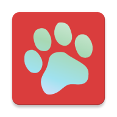
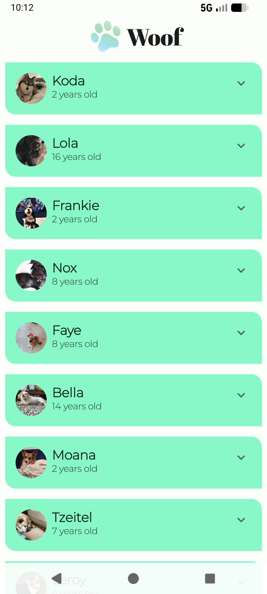
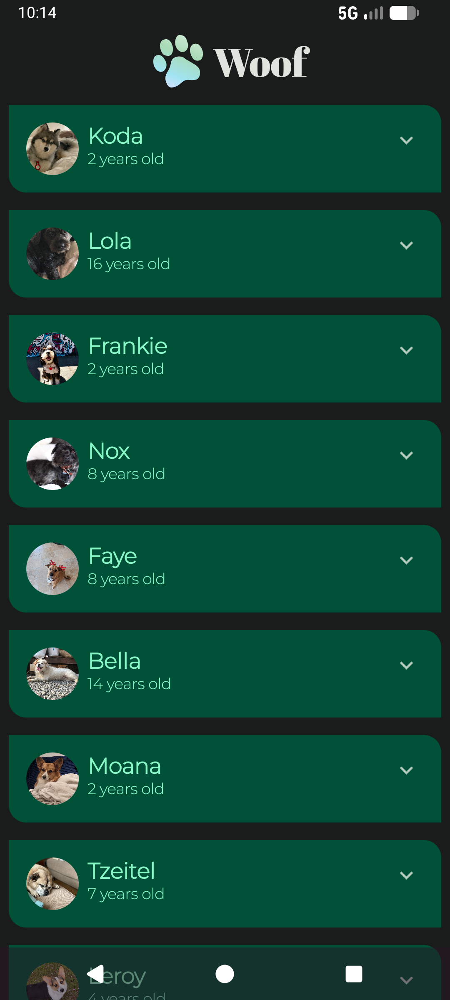

<div align="center">



# Woof App


</div>

## 📖 About the Project

**Woof** is a beautifully designed Android application that displays a list of adorable dogs. This project serves as a showcase for modern Android development practices, specifically focusing on **Jetpack Compose** and **Material Design 3**.

The app features smooth **spring animations** when interacting with list items, providing a delightful and interactive user experience.

## ✨ Key Features

- **Material 3 Design**: Fully implemented using Material 3 components, color schemes, and typography for a modern look.
- **Spring Animations**: Smooth, bouncy expansion animations for list items using Compose's animation APIs.
- **Adaptive Layout**: Designed to be responsive across different screen sizes.

## Screenshots

<table align="center">
  <tr>
    <th align="center">Animation</th>
    <th align="center">Light Mode</th>
    <th align="center">Dark Mode</th>
  </tr>
  <tr>
    <td align="center"></td>
    <td align="center"></td>
    <td align="center"></td>
  </tr>
</table>

## Tech Stack

- **Language**: [Kotlin](https://kotlinlang.org/)
- **UI Framework**: [Jetpack Compose](https://developer.android.com/jetpack/compose)
- **Design System**: [Material Design 3](https://m3.material.io/)
- **Target SDK**: 37
- **Min SDK**: 24

## Project Structure

```text
app/src/main/java/com/example/woof/
├── data/           # Data models
├── ui/theme/       # Material 3 Theme configuration (Color, Type, Shape)
└── MainActivity.kt 
```

## License

This project is licensed under the MIT License - see the [LICENSE](LICENSE) file for details.

## Acknowledgments

This project is a modified version of the [Google Developer Training: Woof App](https://github.com/google-developer-training/basic-android-kotlin-compose-training-woof/tree/main).